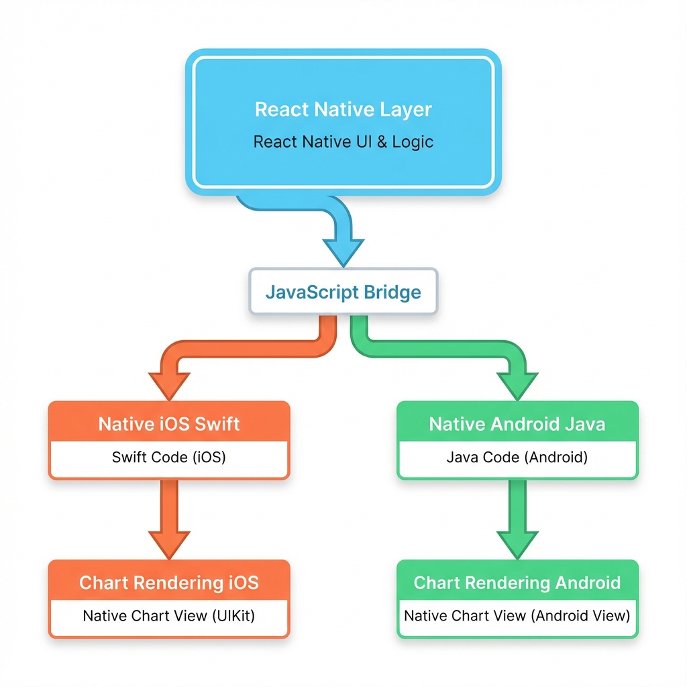
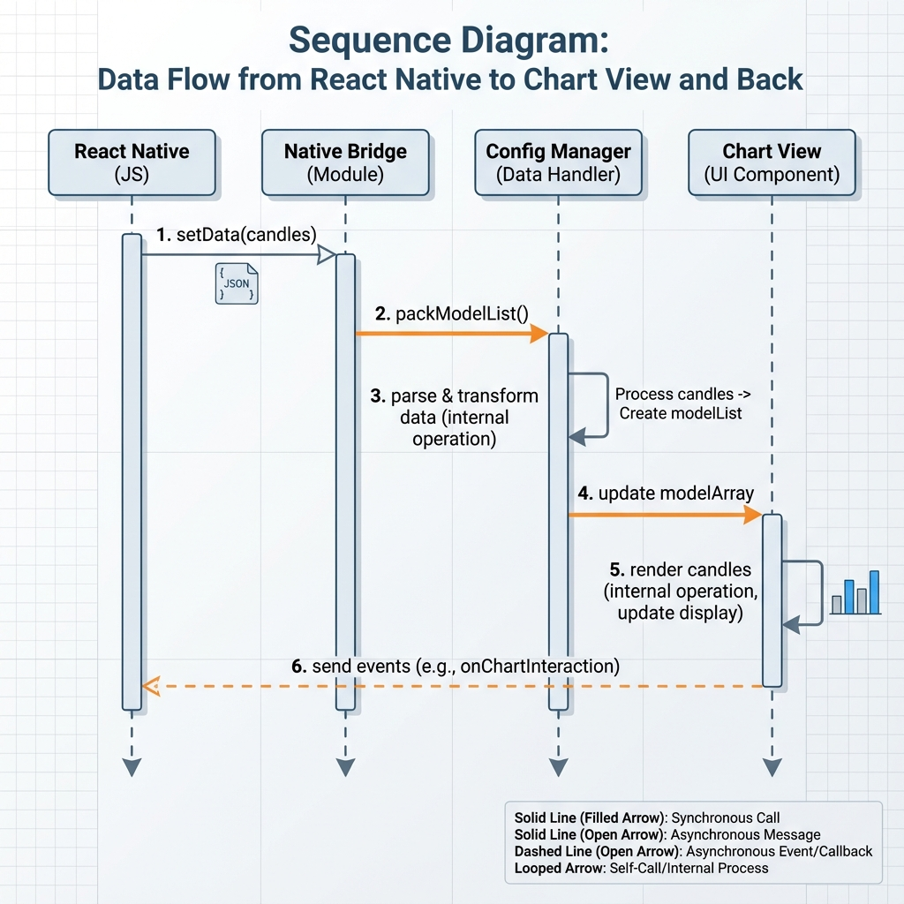
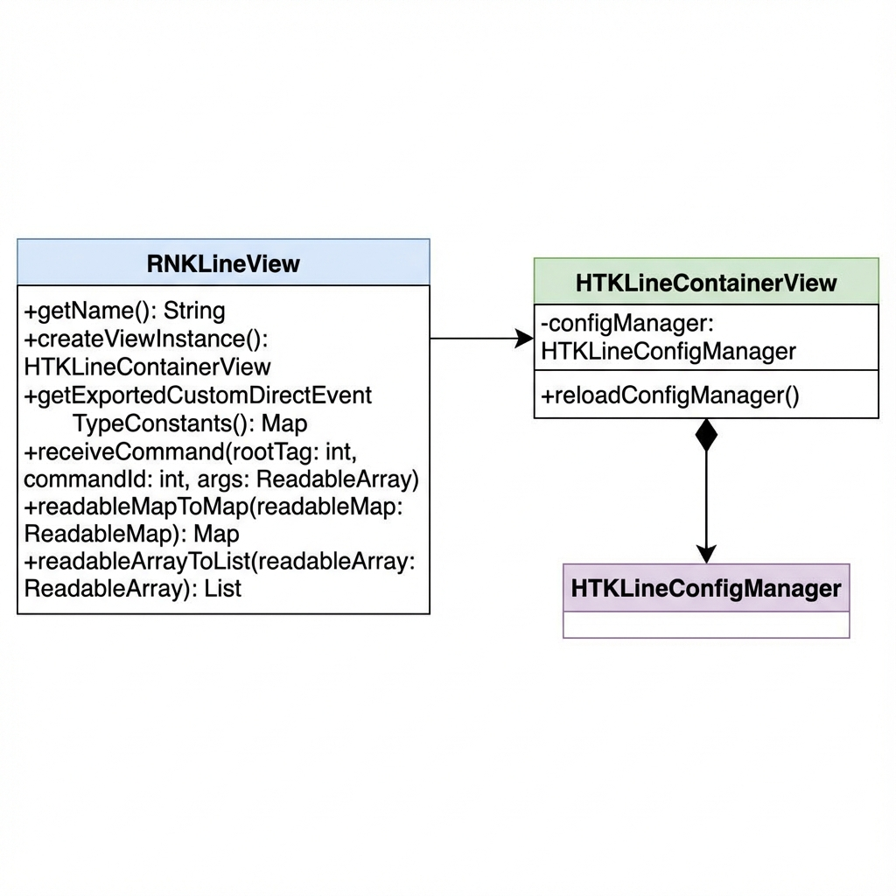
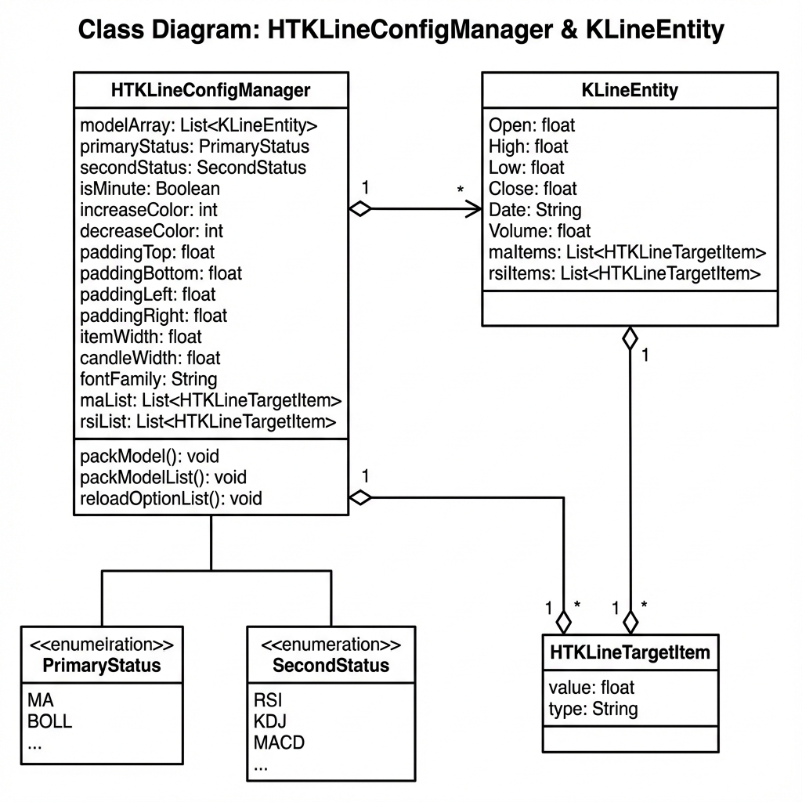
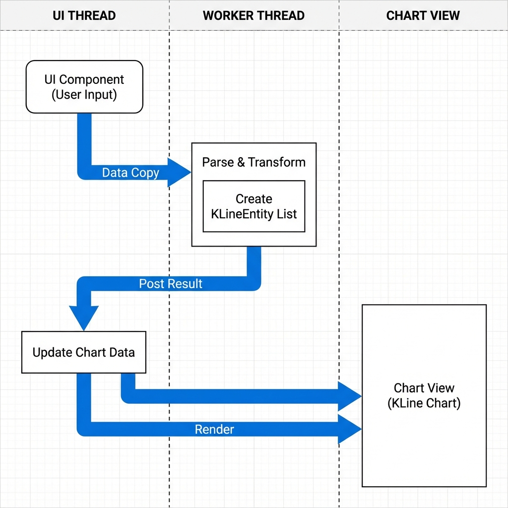

# Phân Tích Source Code: React Native KLine Chart View

## Tổng Quan Dự Án

**Tên**: react-native-kline-view  
**Mục đích**: Thư viện React Native để hiển thị biểu đồ K-Line (nến Nhật) với các chỉ báo kỹ thuật  
**Platform**: Hỗ trợ cả iOS và Android  
**Version**: 1.0.0

---

## Kiến Trúc Tổng Thể



### Luồng Dữ Liệu



---

## Cấu Trúc File Chính

### 1. JavaScript Layer

#### `index.js`

**Vai trò**: Entry point, React component wrapper

**Chức năng chính**:

- Tạo component React với `forwardRef` để expose imperative API
- Xử lý cross-platform command dispatching
- Cung cấp 3 methods chính:
  - `setData(candles)`: Thay thế toàn bộ dữ liệu
  - `appendCandle(candle)`: Thêm nến mới vào cuối
  - `updateLastCandle(candle)`: Cập nhật nến cuối cùng

**Pattern đặc biệt**:

```javascript
// iOS: Gọi trực tiếp qua NativeModules
manager.setData(nodeHandle, payload);

// Android: Sử dụng UIManager command
UIManager.dispatchViewManagerCommand(nodeHandle, commandId, [payload]);
```

#### `index.d.ts`

**Vai trò**: TypeScript type definitions

**Types chính**:

```typescript
type Candle = {
  id: number;
  dateString: string;
  open: number;
  high: number;
  low: number;
  close: number;
  vol: number;
  selectedItemList?: Array<Record<string, any>>;
  [key: string]: any;
};
```

---

### 2. Android Native Layer

#### `android/src/main/java/com/github/fujianlian/klinechart/RNKLineView.java`

**Vai trò**: View Manager cho Android, cầu nối giữa React Native và native UI

**Kiến trúc**:



**Commands được hỗ trợ**:

| Command            | ID  | Mục đích                 |
| ------------------ | --- | ------------------------ |
| `setData`          | 1   | Load toàn bộ dataset mới |
| `appendCandle`     | 2   | Thêm 1 nến mới           |
| `updateLastCandle` | 3   | Cập nhật nến cuối        |

**Threading Model**:

> [!IMPORTANT]
> `RNKLineView` sử dụng multi-threading để tránh block UI thread:
>
> 1. **UI Thread**: Nhận command và copy `ReadableArray` → Java objects
> 2. **Worker Thread**: Parse và transform data (lines 110-123)
> 3. **UI Thread**: Update view và trigger re-render (lines 114-121)

**Code Flow Example**:

```java
// Line 87-124: COMMAND_SET_DATA
case COMMAND_SET_DATA: {
    // 1. Copy data from bridge (UI thread)
    final List<Map<String, Object>> candleMaps = new ArrayList<>();
    for (int i = 0; i < candleArray.size(); i++) {
        candleMaps.add(readableMapToMap(candleArray.getMap(i)));
    }

    // 2. Parse on worker thread
    new Thread(() -> {
        final List<KLineEntity> entities =
            root.configManager.packModelList(candleMaps);

        // 3. Update UI on main thread
        root.post(() -> {
            root.configManager.modelArray.clear();
            root.configManager.modelArray.addAll(entities);
            root.reloadConfigManager();
        });
    }).start();
}
```

**Helper Methods**:

- `readableMapToMap()`: Chuyển `ReadableMap` → `Map<String, Object>`
- `readableArrayToList()`: Chuyển `ReadableArray` → `List<Object>`
- Xử lý tất cả types: Null, Boolean, Number, String, Map, Array

**Props**:

```java
@ReactProp(name = "optionList")
public void setOptionList(HTKLineContainerView containerView, String optionList)
```

Nhận JSON string từ React Native để config chart.

---

#### `android/src/main/java/com/github/fujianlian/klinechart/HTKLineConfigManager.java`

**Vai trò**: Quản lý toàn bộ configuration và data của chart

**Cấu trúc dữ liệu**:



**Các nhóm config**:

1. **Data Configuration**:
   - `modelArray`: Danh sách các nến
   - `shouldScrollToEnd`: Auto scroll đến nến mới nhất
2. **Display Configuration**:

   ```java
   increaseColor = Color.RED;    // Nến tăng
   decreaseColor = Color.GREEN;  // Nến giảm
   itemWidth = 9;                // Độ rộng mỗi item
   candleWidth = 7;              // Độ rộng nến
   ```

3. **Chart Layout**:

   ```java
   mainFlex = 0.716f;     // 71.6% cho main chart
   volumeFlex = 0.122f;   // 12.2% cho volume
   paddingTop/Bottom/Right
   ```

4. **Indicators**:

   - `primaryStatus`: MA (Moving Average) hoặc BOLL (Bollinger Bands)
   - `secondStatus`: MACD, KDJ, RSI, WR
   - Target lists cho các chỉ báo

5. **Drawing Tools** (Vẽ trên chart):
   ```java
   drawType: HTDrawType       // Line, Horizontal, etc.
   drawColor: int
   drawLineHeight: float
   drawDashWidth/Space: float
   drawIsLock: Boolean
   ```

**Method `packModel()`** (lines 202-232):
Transform raw data map → `KLineEntity` object:

```java
entity.id = ((Number)keyValue.get("id")).intValue();
entity.Date = keyValue.get("dateString").toString();
entity.Open = ((Number)keyValue.get("open")).floatValue();
// ... parse all OHLC + Volume
// ... parse indicators (MA, BOLL, MACD, KDJ, RSI, WR)
```

**Method `reloadOptionList()`** (lines 247-441):
Parse JSON config từ React Native:

- `modelArray`: Initial data
- `targetList`: Indicator parameters (MA periods, BOLL N/P, MACD L/M/S, etc.)
- `drawList`: Drawing tool settings
- `configList`: Display & color settings
- `primary/second/time/price/volume`: Chart mode settings

> [!TIP]
> Config này cho phép dynamic configuration từ JavaScript mà không cần rebuild native code.

---

#### `android/src/main/java/com/github/fujianlian/klinechart/KLineEntity.java`

**Vai trò**: Data model cho một nến (candle) và các chỉ báo tương ứng

**Implements**: `IKLine` interface

**Dữ liệu cơ bản**:

```java
public float id;
public String Date;      // Timestamp string
public float Open;       // Giá mở
public float High;       // Giá cao nhất
public float Low;        // Giá thấp nhất
public float Close;      // Giá đóng
public float Volume;     // Khối lượng giao dịch
```

**Chỉ báo được tính toán**:

| Indicator           | Fields                                                         | Description             |
| ------------------- | -------------------------------------------------------------- | ----------------------- |
| MA (Moving Average) | `MA5Price`, `MA10Price`, `MA20Price`, `MA30Price`, `MA60Price` | Đường trung bình động   |
| BOLL (Bollinger)    | `up`, `mb`, `dn`                                               | Dải Bollinger           |
| MACD                | `dea`, `dif`, `macd`                                           | MACD histogram          |
| KDJ                 | `k`, `d`, `j`                                                  | Stochastic oscillator   |
| RSI                 | `rsi`                                                          | Relative Strength Index |
| WR                  | `r`                                                            | Williams %R             |
| Volume MA           | `MA5Volume`, `MA10Volume`                                      | MA của volume           |

**Dynamic Target Lists**:

```java
public List<HTKLineTargetItem> maList = new ArrayList();
public List<HTKLineTargetItem> maVolumeList = new ArrayList();
public List<HTKLineTargetItem> rsiList = new ArrayList();
public List<HTKLineTargetItem> wrList = new ArrayList();
```

Cho phép dynamic configuration của các periods.

**Helper Method**:

```java
public float targetListISMax(List<HTKLineTargetItem> itemList, boolean isMax)
```

Tìm min/max trong target list để scale chart.

---

#### `android/src/main/java/com/github/fujianlian/klinechart/HTKLineTargetItem.java`

**Vai trò**: Model cho một indicator value với metadata

**Structure**:

```java
public class HTKLineTargetItem {
    private boolean selected = false;  // Có hiển thị không
    public int index = 0;              // Thứ tự hiển thị
    public String title = "";          // Label (e.g., "MA5")
    public float value = 0.0f;         // Giá trị
}
```

**Constructor** (lines 16-37):
Parse từ Map với safe defaults:

```java
public HTKLineTargetItem(Map valueList) {
    String title = valueList.get("title").toString();
    Object object = valueList.get("value");
    if (object == null) object = new Double(0);
    float value = ((Number) object).floatValue();
    // ... parse selected & index
}
```

**Static Factory Method**:

```java
public static ArrayList<HTKLineTargetItem> packModelArray(List<Map> valueList) {
    ArrayList<HTKLineTargetItem> modelArray = new ArrayList();
    for (Object object: valueList) {
        HTKLineTargetItem item = new HTKLineTargetItem((Map) object);
        if (item.selected) {  // Chỉ add items được chọn
            modelArray.add(item);
        }
    }
    return modelArray;
}
```

**Use Case**:
React Native có thể send config như:

```javascript
{
  maList: [
    { title: "MA5", value: 5, selected: true, index: 0 },
    { title: "MA10", value: 10, selected: true, index: 1 },
    { title: "MA20", value: 20, selected: false, index: 2 },
  ];
}
```

---

#### `android/src/main/java/com/github/fujianlian/klinechart/KLineChartAdapter.java`

**Vai trò**: Adapter pattern để manage data list

**Extends**: `BaseKLineChartAdapter`

**Data Storage**:

```java
private List<KLineEntity> datas = new ArrayList<>();
```

**Core Methods**:

| Method              | Purpose            | Implementation                    |
| ------------------- | ------------------ | --------------------------------- |
| `getCount()`        | Số lượng nến       | Return `datas.size()`             |
| `getItem(position)` | Lấy nến tại vị trí | Return `datas.get(position)`      |
| `getDate(position)` | Lấy date string    | Return `datas.get(position).Date` |

**Data Operations**:

1. **addHeaderData()** (lines 36-41):

   ```java
   public void addHeaderData(List<KLineEntity> data) {
       if (data != null && !data.isEmpty()) {
           datas.clear();
           datas.addAll(data);
       }
   }
   ```

2. **addFooterData()** (lines 46-51):

   ```java
   public void addFooterData(List<KLineEntity> data) {
       if (data != null) {
           datas.clear();
           datas.addAll(0, data);  // Insert at beginning
       }
   }
   ```

3. **reloadKLineItem()** (lines 53-67):
   Find by date, update or append:

   ```java
   for (int i = 0; i < datas.size(); i++) {
       KLineEntity model = datas.get(i);
       if (model.getDate().equals(entity.getDate())) {
           findIndex = i;
           break;
       }
   }
   if (findIndex != -1) {
       datas.set(findIndex, entity);  // Update
   } else {
       datas.add(entity);             // Append
   }
   ```

4. **changeItem()** & **clearData()**:
   Direct manipulation với `notifyDataSetChanged()`

---

## Patterns & Best Practices

### 1. Threading Strategy



**Lý do**: Parsing JSON và transforming data có thể mất thời gian với large datasets.

### 2. Type Safety

Mọi conversion đều có null checking và type casting:

```java
Object object = keyValue.get("value");
if (object == null) {
    object = new Double(0);
}
float value = ((Number) object).floatValue();
```

### 3. Config-Driven Design

Chart behavior hoàn toàn configurable từ JavaScript:

- Colors, sizes, fonts
- Indicators và parameters
- Drawing tools
- Layout proportions

### 4. Event System

Native → React Native events:

```java
public static String onDrawItemDidTouchKey = "onDrawItemDidTouch";
public static String onDrawItemCompleteKey = "onDrawItemComplete";
public static String onDrawPointCompleteKey = "onDrawPointComplete";
```

### 5. Adapter Pattern

Sử dụng adapter để decouple data management khỏi view rendering.

---

## Data Flow Chi Tiết

### Scenario 1: Load Initial Data

**Sequence**: JavaScript → RNKLineView → ConfigManager → ChartView

1. JavaScript gọi `setData([candles])`
2. RNKLineView nhận và convert `ReadableArray` → Java objects
3. Worker thread parse từng candle với `packModelList()`
4. Mỗi candle được parse OHLC + indicators
5. Update `modelArray` trên UI thread
6. Trigger `reloadConfigManager()` để render chart

### Scenario 2: Update Last Candle (Real-time)

**Sequence**: JavaScript → RNKLineView → ConfigManager

1. JavaScript gọi `updateLastCandle(candle)`
2. RNKLineView parse candle thành `KLineEntity`
3. Kiểm tra `modelArray`:
   - Nếu rỗng: Add entity mới
   - Nếu có data: Replace entity cuối cùng (index = size - 1)
4. Trigger `reloadConfigManager()` để render

---

## Configuration Schema

### OptionList JSON Structure

```javascript
{
  // Initial data
  modelArray: [{ id, dateString, open, high, low, close, vol, ... }],

  // Chart indicators
  targetList: {
    maList: [{ title, value, selected, index }, ...],
    maVolumeList: [...],
    rsiList: [...],
    wrList: [...],
    bollN: "20",
    bollP: "2",
    macdL: "26",
    macdM: "9",
    macdS: "12",
    kdjN: "9",
    kdjM1: "3",
    kdjM2: "3"
  },

  // Drawing tools
  drawList: {
    shotBackgroundColor: 0xFF...,
    drawType: 0,
    drawShouldContinue: false,
    shouldFixDraw: false,
    shouldClearDraw: false,
    drawColor: 0xFF...,
    drawLineHeight: 1,
    drawDashWidth: 1,
    drawDashSpace: 1,
    drawIsLock: false,
    shouldReloadDrawItemIndex: -1,
    drawShouldTrash: false
  },

  // Display configuration
  configList: {
    colorList: {
      increaseColor: 0xFF...,
      decreaseColor: 0xFF...
    },
    mainFlex: 0.716,
    volumeFlex: 0.122,
    minuteLineColor: 0xFF...,
    paddingRight: 0,
    paddingTop: 0,
    paddingBottom: 0,
    itemWidth: 9,
    candleWidth: 7,
    fontFamily: "...",
    textColor: 0xFF...,
    headerTextFontSize: 9,
    rightTextFontSize: 10,
    candleTextFontSize: 11,
    // ... many more display options
    targetColorList: [0xFF..., ...],
    minuteGradientColorList: [0xFF..., ...],
    minuteGradientLocationList: [0, 1]
  },

  // Chart modes
  primary: 1,  // 1=MA, 2=BOLL
  second: 3,   // 3=MACD, 4=KDJ, 5=RSI, 6=WR
  time: -1,    // -1=minute mode
  price: 2,    // decimal places
  volume: 0,

  shouldScrollToEnd: true
}
```

---

## iOS Implementation (Swift)

iOS implementation tương tự với các files:

- `ios/Classes/RNKLineView.swift` - View manager
- `ios/Classes/HTKLineConfigManager.swift` - Config management
- `ios/Classes/HTKLineModel.swift` - Data model
- `ios/Classes/HTKLineContainerView.swift` - Container view
- `ios/Classes/HTMainDraw.swift`, `HTVolumeDraw.swift` - Drawing components
- `ios/Classes/RNKLineViewCommands.swift/m` - Command handling

Pattern tương tự Android nhưng implement bằng Swift.

---

## Tổng Kết

### Điểm Mạnh

1. **Cross-platform**: Code base riêng biệt iOS/Android nhưng API thống nhất
2. **Performance**: Multi-threading, efficient rendering
3. **Flexible**: Config-driven, không cần rebuild để thay đổi appearance
4. **Rich Features**: Nhiều indicators, drawing tools
5. **Type-safe**: TypeScript definitions cho JavaScript layer

### Điểm Cần Lưu Ý

1. **Threading**: Cần hiểu rõ flow để avoid race conditions
2. **Memory**: Large datasets có thể impact performance
3. **Config complexity**: JSON schema khá phức tạp
4. **Platform differences**: iOS dùng NativeModules, Android dùng UIManager

### Use Cases Chính

- Real-time cryptocurrency/stock charts
- Historical data visualization
- Technical analysis tools
- Trading platforms

> [!NOTE]
> Library này được thiết kế để highly customizable, nhưng đòi hỏi hiểu rõ về technical indicators và chart rendering để sử dụng hiệu quả.
